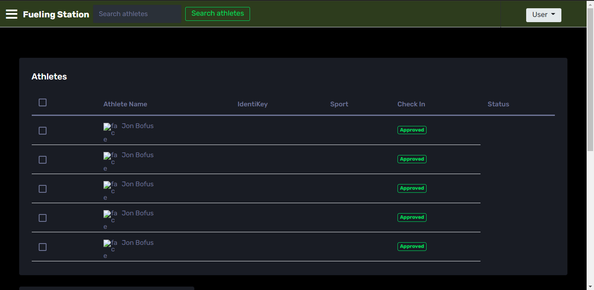

# Fueling Station Web App


By: Team 0x1 (014-01)
- Tyler McCormick
- Ryan Chaknova 
- Michael Metz 
- John Aldrete
- Jake Derouin

Course: &nbsp; &nbsp; &nbsp; 3308 - Software Development Methods & Tools <br>
University: &nbsp;CU Boulder <br>
Semester: &nbsp; Spring 2022

<br>


## Pipeline
### <u>Bridge</u> : [`https://github.com/jpderouin/Fueling-Station-Bridge-macOS`](https://github.com/jpderouin/Fueling-Station-Bridge-macOS)


<br>


## Installation

1. Install [node.js](https://nodejs.org/en/)
2. Download repo
3. Install dependencies

   ```jsx
   npm install
   ```

5. Start the environment

   ```jsx
   npm start
   ```


<br>

## Points of Contention
1. Team Synchronization
2. 

<br>


## Documentation

### <u>Initial Planning</u>
#### Low Fidelity
Sketch <br>
<figure>

   
   Hand drawn 
</figure>
<br>
<br>
Wireframe <br>
~
<br>
<br>

#### High Fidelity
1. Design v1 <br>
<figure>

   
   Using Figma
</figure>
<br>
<br>
2. Design v2 <br>
<figure>

   
   Using Adobe XD
</figure>
<br>
<br>
3. Design v3 <br>
<figure>

   
   Using Adobe XD
</figure>
<br>
<br>


### <u>Templating Engine</u>
   [`Embedded Javascript Templating Engine`](https://ejs.co/)

<br>


### <u>Databases</u>

#### Firebase

Firebase module is initiated at  `./db/initFirebase.js`

```jsx
const firebaseConfig = {  
   apiKey:      process.env.FIREBASE_API_KEY,  
   authDomain:  process.env.FIREBASE_AUTH_DOMAIN,  
   databaseURL: process.env.FIREBASE_DATABASE_URL,  
   projectId:   process.env.FIREBASE_PROJECT_ID,  
};
```

<br>


### <u>File Management</u>

  <pre>  
  
	├── fueling-station-app  
	  ├── db/
		  ├── initFirebase.js
		  ├── initPostgresql.js
	  ├── docs/
		  ├── images/
	  ├── src/  
	  	  ├── public/
			  ├── css/
			  ├── images/  
			  ├── js/  
			  ├── styles/  
			  ├── vendor/  
		  ├── control/
			  ├── analyticControl.js
			  ├── athleteControl.js
			  ├── authControl.js
			  ├── dashboardControl.js
			  ├── menuControl.js
			  ├── noteControl.js
			  ├── userControl.js
		  ├── routes/
			  ├── analyticRoutes.js
			  ├── athleteRoutes.js
			  ├── authRoutes.js
			  ├── dashboardRoutes.js
			  ├── menuRoutes.js
			  ├── noteRoutes.js
			  ├── userRoutes.js
		  ├── modals/
		   	  ├── analyticModals.js
		   	  ├── athleteModals.js
		   	  ├── authModals.js
		   	  ├── dashboardModals.js
			  ├── menuModals.js
			  ├── noteModals.js
			  ├── userModals.js
		  ├── seeds/
		  ├── utils/
		  	  ├── catchAsync.js
			  ├── ValidationError.js
		  ├── views/
		  	  ├── errors/
		  	  	  ├── 400.ejs
				  ├── 404.ejs
				  ├── 500.ejs
		  	  ├── layouts/
		  	  	  ├── boilerplate.ejs
		  	  ├── partials/
		  	  	  ├── auth/
				  ├── dropdown.ejs
				  ├── flash.ejs
				  ├── footer.ejs
				  ├── header.ejs
				  ├── navigation.ejs
				  ├── spinner.ejs
		  	  ├── components/
				  ├── dashboardTableRow.ejs
		  	  ├── user/
		  	  	  ├── login.ejs
				  ├── profile.ejs
				  ├── register.ejs
			  ├── menus/
			  ├── teams/
			  ├── sports/
		  	  ├── athletes/
			  ├── dashboard.js
		  ├── app.js
		  ├── middleware.js
		  ├── createStore.js
		  ├── reducer.js  
		  ├── schema.js 
	  	  ├── serviceWorker.js  
	  ├── dev_cmd.txt
	  ├── README.md
	  ├── package.json  
	   
</pre>


#### Folders and the functionality in `./src/`
```jsx
/control/             -> for functions and other module services
/routes/              -> for entity routing
/schemas/             -> for data table entity modaling
/utils/               -> for headers and proxy
/seeds/               -> for database dummy data templates
/views/               -> for page templates 
/app.js 	      -> for initial entry into application service
```

#### Folders and the functionality in `./db/`
```jsx
/migrations/          -> for copying data from source db to target db
/initFirebase.js      -> for Firebase connection initialization
/initPostgres.js      -> for PostgreSQL connection initialization
```

<br> 


### <u>Middleware</u>

```jsx
/* 
    Apply randomly generated secure token to every request
    verifying request object is authentic
*/
app.all("*", (req, res, next) => {
    res.cookie("XSRF-TOKEN", req.csrfToken());
    next();     // Continue path to login
});
```

```jsx
// Grant each visitor a unique session
app.use(session({
    secret:            "BigOlSecret",       
    resave:            false,
    saveUninitialized: false,
    cookie:            {
        maxAge: 2 * 60 * 1000
    }
}));
```


<br>


### <u>List of Features</u>
<ul>
   <li>
      <span style="color: #e97623">Identikey login system</span>
      <p></p>
   </li>
<br>
   <li>
      <span style="color: #e97623">CSV data conversion & spreadsheet export</span>
      <p></p>
   </li>
<br>
   <li>
      <span style="color: #e97623">Messaging system</span>
      <p>An internal communications note taking system to allow for seamlessly <br> feedback 
         between managers, coaches, and their teams.
      </p>
   </li>
<br>
   <li>
      <span style="color: #e97623">Diet planning</span>
      <p>Allows for nutrition staff to curate meals for their athletes.</p>
   </li>
<br>
   <li>
      <span style="color: #e97623"></span>
      <p></p>
   </li>
<br>
</ul>
<br>


### <u>Templates & Tools Used</u>

1. Adobe Color <br>
   [`color.adobe.com`](https://color.adobe.com/explore)


2. Adobe XD <br>
   [`adobe.com/products/xd`](https://www.adobe.com/products/xd.html)


3. Axios <br>
   [`axios-http.com`](https://axios-http.com/)


4. Bootstrap <br>
   [`getbootstrap.com`](https://getbootstrap.com/)


5. DevToys <br>
   [`devtoys.app`](https://devtoys.app/)


6. Figma <br>
   [`figma.com`](https://figma.com)


7. Firebase <br>
   [`firebase.google.com`](https://firebase.google.com/)


8. Github <br>
   [`github.com`](https://github.com/)


9. Material Design <br>
   [`material.io`](https://material.io/design)


10. NodeJS <br>
   [`nodejs.org`](https://nodejs.org/en/)


11. PostgreSQL <br>
   [`postgresql.org`](https://www.postgresql.org/)


12. React-Markdown <br>
   [`react-markdown`](https://github.com/remarkjs/react-markdown)

<br>


## Progression

### Front Facing

- March 20th WIP


  - Header Navigation Bar 
    1. Dropdown
    2. Search functionality
    3. Logged-in user directory  
  - User login based appearances
  - Authentication System

<br>

- April 1st WIP


  - 'Welcome' splash page added
  - Router progess
  - Seem to have correctly coded in <b>how</b> to query and contain db data pulled during 
    routing, but have not successfully gotten the data to display in html (likely an issue with 
    json parsing)
  - Need to delineate on how we want to organize user permissions


<br>

- April 10th WIP


    -


